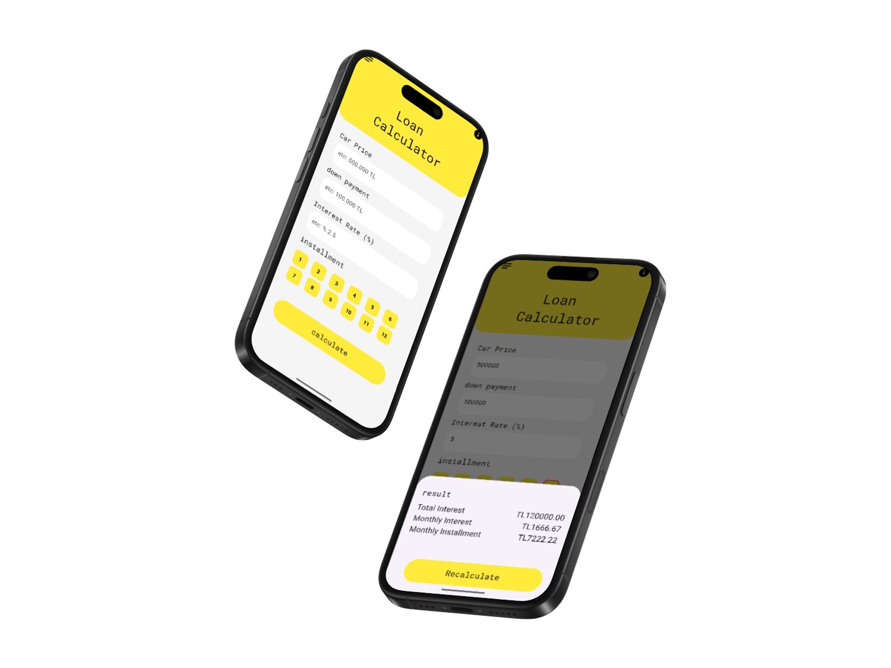

# Loan Calculator App


A modern app to quickly and easily calculate your loans!

## Table of Contents

- Features
- Screenshots
- Installation
- Usage
- Contributing
- Contact

## Features

- Input loan amount, interest rate, and term period
- Automatic calculation of monthly payment, total payment, and total interest
- User-friendly and modern interface

## Screenshots



## Installation

```bash
# Clone the repository
git clone https://github.com/HuseyinKaanAkdeniz/Loan-Calculator-App.git

# Navigate to the project directory
cd Loan-Calculator-App

# Install dependencies
flutter pub get

# Run the application
flutter run
```
Minimum Flutter SDK: 28

## Usage

After launching the app, simply enter the loan amount, interest rate, and term to quickly view your results.

## Contributing

Contributions are welcome! Please open an issue to discuss your ideas before submitting a pull request.

- Fork the project
- Create a new branch (`git checkout -b your-feature`)
- Commit your changes (`git commit -m 'Add some feature'`)
- Push to the branch (`git push origin your-feature`)
- Open a pull request

## Contact

For more information: [simolexbusinnes@gmail.com](mailto:simolexbusinnes@gmail.com)  
Development insights: [My Medium Profile](https://medium.com/@kaanakdeniz)
